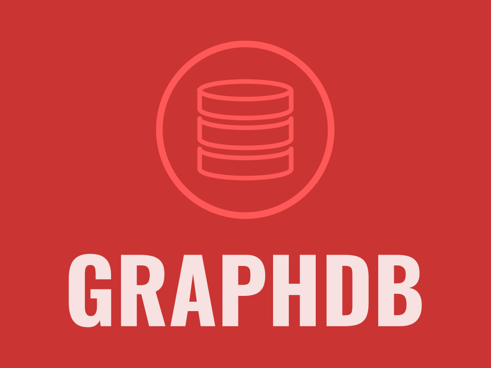
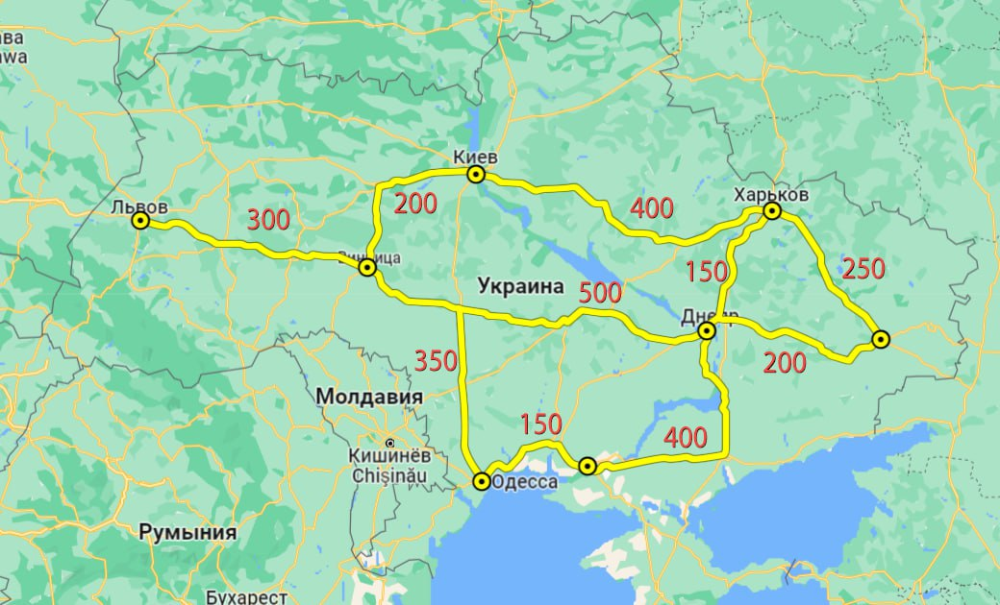
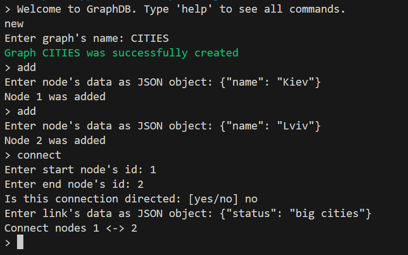

# GraphDB
<div align="center">
  <a href="https://github.com/kovaliovev/ip-tool">
    
  </a>
</div>

## General information
> __Graph database__ stores nodes and relationships instead of tables, or documents. Data is stored just like you might sketch ideas on a whiteboard. Your data is stored without restricting it to a pre-defined model, allowing a very flexible way of thinking about and using it.
## Instalation
#### git
```
git clone https://github.com/kol-oss/GraphDB.git
```
## Usage
To show all availbale methods and functions of GraphDB, I added two realisation examples for different usage purposes. 
### Dijkstra's algorithm
> Dijkstra's algorithm is an algorithm for finding the shortest paths between nodes in a weighted graph, which may represent, for example, road networks. It was conceived by computer scientist Edsger W. Dijkstra in 1956 and published three years later.


This graphic is used in app/dijkstra program to show usage of GraphDB for creation nodes and links between them.
#### Example of result:
``` js
From Kiev Map(7) {
  'Vinitsa' => 200,
  'Kharkiv' => 400,
  'Lviv' => 500,
  'Odesa' => 550,
  'Dnipro' => 550,
  'Donetsk' => 650,
  'Kherson' => 700
}
```
#### Runner
```
node app/dijkstra/distances.js
```
### Command line interface
> A command-line interface (CLI) is a text-based user interface (UI) used to run programs, manage computer files and interact with the computer. Command-line interfaces are also called command-line user interfaces, console user interfaces and character user interfaces.


This interface was created to show how GraphDB can be used in real client-server application using command line for interacting with graph and connections between nodes.
#### Example of result
``` js
> nodes
Node #1 [data]:
{ name: 'Kiev' }
Node #2 [data]:
{ name: 'Lviv' }
```
#### Runner
```
node app/interface/speaker.js
```